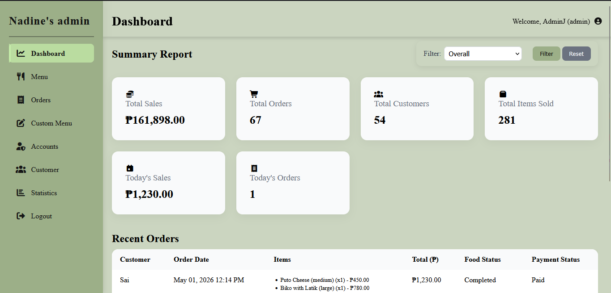
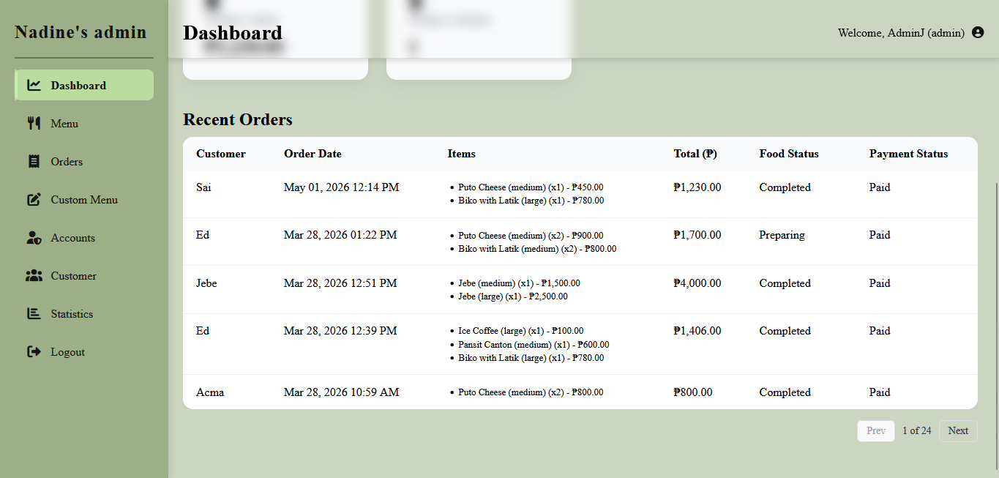
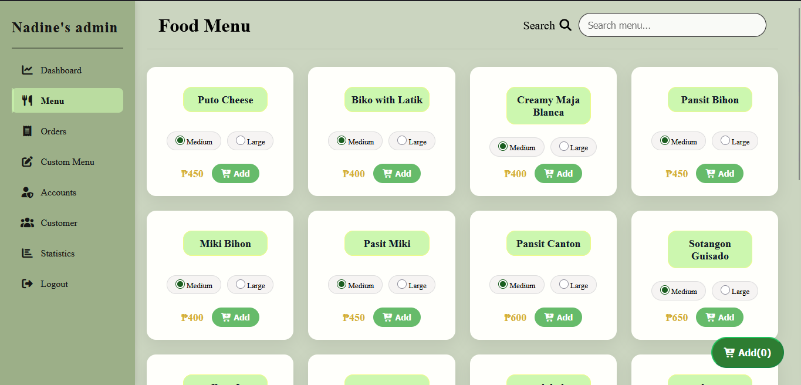
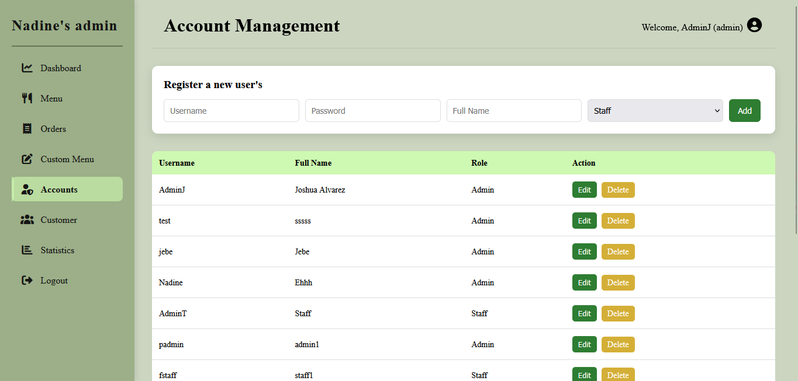

# Resto POS System

**Capstone Project** – A restaurant order and menu management system built using **PHP**, **MySQL**, and **XAMPP**.
Designed to help restaurant staff efficiently manage menus, orders, and daily operations through a clean and responsive interface.

---

## System Preview
>⚠️Note: The data shown here is for demonstration purposes only and does not represent real data.

<p align="center">
  
  
  
</p>

<p align="center">
  
  
  
</p>

<p align="center">
  
  
</p>
---

## Features

  **Menu Management**
  Add, edit, delete, and categorize menu items with images.

  **Order Management**
  Track, update, and filter customer orders in real-time.

  **Dashboard Analytics**
  View sales insights and order summaries.

  **User Authentication**
  Secure login system with role-based access.

  **Security**

  * Password hashing using `password_hash()`
  * Protection against SQL Injection

  **Responsive UI**
  Optimized for desktop and smaller screens.

---

## Tech Stack

| **Category**             | **Technology**                |
|--------------------------|-------------------------------|
|  **Frontend**          | HTML, CSS, JavaScript         |
|  **Backend**           |  PHP (Procedural)             |
|  **Database**          |  MySQL                        |
|  **Server**            | XAMPP                         |
|   **Libraries**         | Font Awesome                  |

---

## Development Progress

* See the [TODO List](TODO.md) for upcoming features and improvements.

---

## Contribution

We welcome contributions! Please follow the proper workflow:

1. **Fork the repository**

2. **Create a new branch**

```bash
git checkout -b feature/your-feature-name
```

3. **Make your changes and commit**

```bash
git add .
git commit -m "feat: add new feature"
```

4. **Push your branch**

```bash
git push origin feature/your-feature-name
```

5. **Open a Pull Request**

📌 Please read:

* `CONTRIBUTING.md`
* `CODE_OF_CONDUCT.md`
* `SECURITY.md`

---

## Installation

1. Clone the repository:

```bash
git clone https://github.com/devstygian/Resto-POS.git
```

2. Move to XAMPP directory:

```bash
C:\xampp\htdocs\Resto-POS
```

3. Start **Apache** and **MySQL** in XAMPP

4. Import database:

* Open **phpMyAdmin**
* Import: `database/schema.sql`

5. Run the system:

```bash
http://localhost/Resto-POS
```

---

## Project Documentation

This repository includes internal documentation:

* `DOCUMENTATION.md` → Architecture, modules, endpoints, and system logic

Use this to quickly understand the system structure.

---

## Commit Convention

```bash
feat:     new feature
fix:      bug fix
style:    UI / CSS changes
refactor: code improvement (no feature)
chore:    cleanup / minor changes
docs:     documentation
test:     testing
```

---

## Author

**DevStygian**
📧 [hackstygian@gmail.com](mailto:hackstygian@gmail.com)

---

## 📌 Notes

* This project is developed for **educational purposes**
* Not intended for production use without further improvements (security, scaling, validation)

---

⭐ If you find this project useful, feel free to star the repository!
